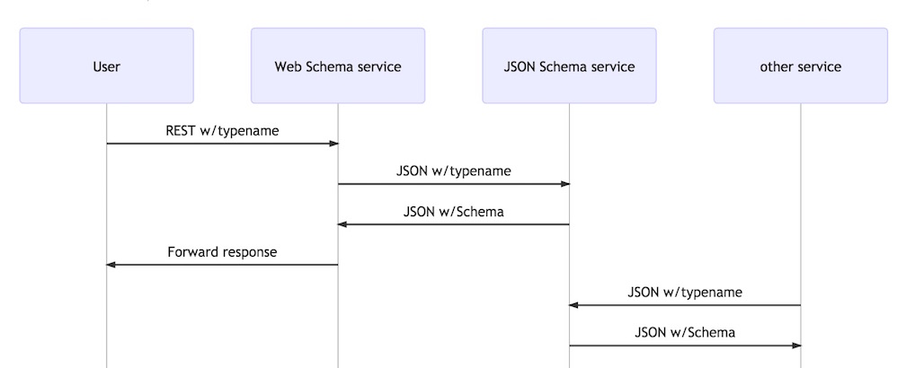

# A JSON Schemas Micro-Service based on Seneca

This provides a simple service that returns the JSON schema for a given typename.

This project is provides a simple example of how to use *seneca* for a useful micro-service.
The main logic is in the *seneca* plugin [src/ts/schemas-plugin.ts](src/ts/schemas-plugin.ts), which is contained in the JSON Schema service.

The Schema service consists of two parts:  
- a JSON Schema service  
This takes a JSON request, looks up a schema from its typename, and returns it.  
This service wraps [tv4-via-typenames-node](https://www.npmjs.com/package/tv4-via-typenames-node)
- a Web Schema service  
This takes a REST request, and passes a JSON request to the schemas service

**A sequence diagram showing how this fits into a system:**


## Install
```
npm install schemas-files-service
make setup
```


## Build
```
make build
```

## test
```
make test
```

## Build and test
```
make
```

## Run Service and Web API Server
In one command shell, run:
```
node schemas-pin-service.js --seneca.log=plugin:schemas
```

And in another command shell, run:
```
node schemas-app.js --seneca.log=plugin:web,plugin:api
```

Then from a browser, issue these queries that should return a schema:

- [http://localhost:3000/api/schemas?typename=SHA1](http://localhost:3000/api/schemas?typename=SHA1)
- [http://localhost:3000/api/schemas?typename=Draft-04](http://localhost:3000/api/schemas?typename=Draft-04)

and this query that should return an error:

- [http://localhost:3000/api/schemas?typename=Unicorn](http://localhost:3000/api/schemas?typename=Unicorn)

# Support
If you have any questions, suggestions, or problems,
please email me at my address given on npm, or file an issue.
